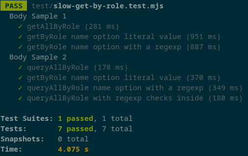
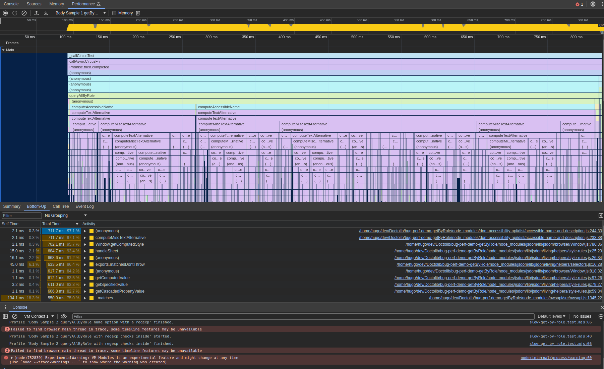

# bug-perf-demo-getByRole
* Samples to reproduce https://github.com/testing-library/dom-testing-library/issues/698#issuecomment-17938725398
* The main issue is definitely in `computeAccessibleName` see https://github.com/eps1lon/dom-accessibility-api/issues/1011

## 🐌🐌🐌🐌🐌🐌🐌🐌🐌🐌🐌🐌🐌🐌🐌🐌🐌🐌🐌🐌🐌🐌🐌🐌

